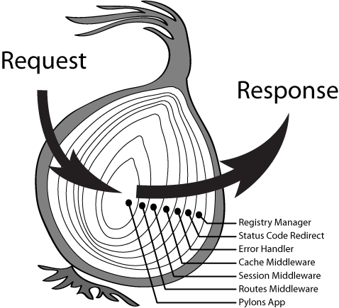

#   NODE

    特性：事件驱动、非阻塞式 I/O、单线程。
    优缺点：能做啥，不适合做啥。

    - Node.js 是单进程单线程应用程序，但是通过事件和回调支持并发，所以性能非常高。
    - Node.js 的每一个 API 都是异步的，并作为一个独立线程运行，使用异步函数调用，并处理并发。
    - Node.js 基本上所有的事件机制都是用设计模式中观察者模式实现。
    - Node.js 单线程类似进入一个while(true)的事件循环，直到没有事件观察者退出，
            每个异步事件都生成一个事件观察者，如果有事件发生就调用该回调函数。

    NodeAPI如Path、Http、Child Process等，其实现原理。

    Node的底层运行原理、和浏览器的异同。

    Node事件驱动、非阻塞机制的实现原理。

##  nodejs自带的库

##  chunk、pipe、stream

##  单线程与事件驱动

    nodejs是一个单线程的，采用事件驱动和异步回调的机制。
    执行代码时，主线程从上往下依次执行，遇到需要回调的地方，比如I/O，将其加入到事件队列，
    主线程继续往下执行，运行结束后，线程空闲，这时依次执行事件队列中的事件。

    注意：单线程指的是主线程是单线程，主线程用于业务处理，即CPU运算，
        nodejs内部会开启其他的线程去处理I/O，比如worker-thread，
        I/O处理完后会有一个回调事件，回调事件将会放到事件队列里，
        在node进程启动时，会创建一个Event Loop，每一次轮询都会去检查是否有事件需要处理，
        如果有就进行执行，并进行下一次轮询。

    nodejs最大的缺陷也是单线程，如果遇到计算密集的任务，比如计算斐波那契数列，
        主线程将会一直执行计算直至计算完毕再执行其他的任务，即此时的主线程是“阻塞的”。

    队列和栈：队列是先进先出，后进后出；
            栈是先进后出，后进先出；

##  EventEmitter 类

    1、所有的异步I/O操作都会分发事件，产生事件的对象都是一个EventEmitter的实例。
        var EventEmitter = require('events').EventEmitter;
        var event = new EventEmitter();
        event.on('some_event', function() {
            console.log('some_event 事件触发');
        });

    2、监听器一般增加到10个就会发出警告。

    3、要触发事件时，触发emit即可。
        event.emit('some_event');

    4、事件只需要触发一次，用
        event.once("some_event",()=>{  })

    5、移除指定事件的某个监听器，监听器必须是该事件已经注册过的监听器。
        接受两个参数，第一个是事件名称，第二个是回调函数名称。
        event.removeListener('some_event',callback)

    6、EventEmitter定义了一个error事件，当error事件触发时，如果没有响应的监听器，
        Nodejs会将其当做一个异常，退出程序并输出错误信息，
        因此需要设置error事件的监听器，避免遇到错误后整个程序崩溃。

    7、继承EventEmitter：原型继承、类继承（ES6）、对象继承

##  browser和nodejs ，runtime的异同

    谷歌浏览器和nodejs都使用了V8作为js引擎，因此在js的解析上基本一致。
        区别在于，浏览器有BOM、DOM，nodejs没有。
        nodejs提供了一套服务器的API，有os、fs、path、net、child process等。

#   Express

    Connect

##  中间件机制

    Web请求将一个一个经过中间件，并通过其中一个中间件返回。
    app.use的原理就是中间件机制。
    一个请求发送到服务器，服务器从收到请求到响应，需要做一系列的操作，
        比如连接数据库，比如对获取到的数据进行处理，
        将这一系列操作拆分成一个一个部分，这里的每一个部分就是一个中间件。

    app.use用于加载中间件，中间件是一个函数，函数有一个next参数，next表示了函数数组的下一个函数。

    express内部维护了一个函数数组（Layer数组），这个函数数组表示了在发出响应之前需要执行的所有函数，也就是中间件数组。
        使用app.use(function(){})后，这个function会被加入到函数数组中；
        function执行完之后，使用next方法，继续执行函数数组中的下一个函数。
        如果没有next()的调用，下一个函数就不会执行了，也就是调用会被终止。

##  剥洋葱模型

    一个request进来，先后经过一层一层的中间件，再从某一层中间件发出去response。
    也就是中间件机制。

    如下代码：
        var express = require('express');
        var app = express();

        app.use((req, res, next) {
            console.log('1 before next()');
            next();
            console.log('1 after next()');
        });
        app.use((req, res, next) {
            console.log('2 before next()');
            next();
            console.log('2 after next()');
        });
        app.use((req, res, next) {
            console.log('3 before next()');
            next();
            console.log('3 after next()');
        });

        app.listen(3000, function () {
            console.log('listen 3000...');
        });

    打印结果为：
        1 before next()
        2 before next()
        3 before next()
        3 after next()
        2 after next()
        1 after next()

#   Koa

##  Koa和Express有什么不同？

    源码上：koa使用了ES6，express还是传统的ES5。
    next()：express处理next()是直接执行函数，即回调函数的方式。
            koa处理next()是直接返回了一个promise对象

    router：express自带router功能，koa需要引入一个router的包。

    Express第一个问题是回调地狱的问题，回调嵌套过多，可以引入ES6解决、或使用event、proxy
            第二个问题是异常不可捕获的问题。
    Koa最大的优势是，本身使用ES6，generator配合promise解决了回调地狱的问题。

##  koa和express的中间件机制

    express基于connect中间件框架。
    koa基于co中间件框架。

    express:
        const connect = require('connect')
        const app = connect()
        app.use(function f1 (req, res, next) {
            console.log('f1')
            next()
            console.log('f1 end')
        })
        app.use(function f2 (req, res, next) {
            console.log('f2')
            next()
            console.log('f2 end')
        })
        app.use(function f3 (req, res, next) {
            console.log('f3')
            res.end('hello')
        })
        app.listen(8080)

        // express的next是一个回调函数，实际执行过程类似如下，伪代码：

        http.createServer(function (req, res) {
            console.log('f1')
            f1 (req, res) {
                console.log('f2')
                f2 (req, res) {
                    f3 (req, res) {
                        console.log('f3')
                        res.end('hello')
                    }
                }
                console.log('f2 end')
            }
            console.log('f1 end')
        }).listen(8080)

    koa:
        const Koa = require('koa')
        const app = new Koa()
        app.use(async function f1 (ctx, next) {
            console.log('f1')
            await next()
            console.log('f1 end')
        })
        app.use(async function f2 (ctx, next) {
            console.log('f2')
            await next()
            console.log('f2 end')
        })
        app.use(async function f3 (ctx) {
            console.log('f3')
            ctx.body = 'hello'
        })
        app.listen(8080)

        // koa的next是一个promise对象，它的执行过程类似如下：
        Promise.resolve(async f1 () {
            console.log(f1)
            await Promise.resolve(async f2 () {
                console.log(f2)
                await Promise.resolve(async f3 () {
                    console.log(f3)
                    ctx.body = 'xxx'
                })
                console.log(f2 end)
            })
            console.log(f1 end)
        })

    两者输出的内容顺序是一样的。
